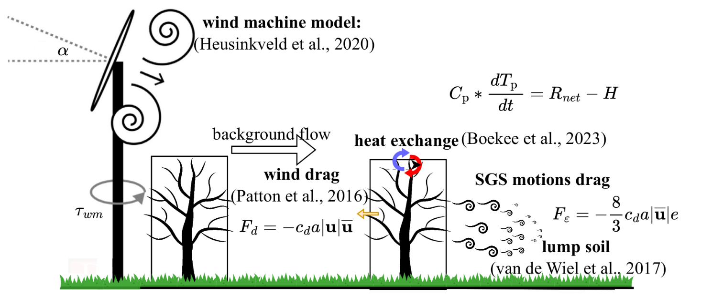

# An integrated LES for modeling plant-tissue warming induced by wind machine in an orchard canopy

## Overview of the files

There are three folders in this repository, `operation`, `spin-up`, and `analys`.

We use `spin-up` code to privide initial condition for `operation` mode. `analys` code can be used to reproduce the plots in [paper](https://doi.org/10.1016/j.agrformet.2024.110175).

The physical modules implemented in this model

